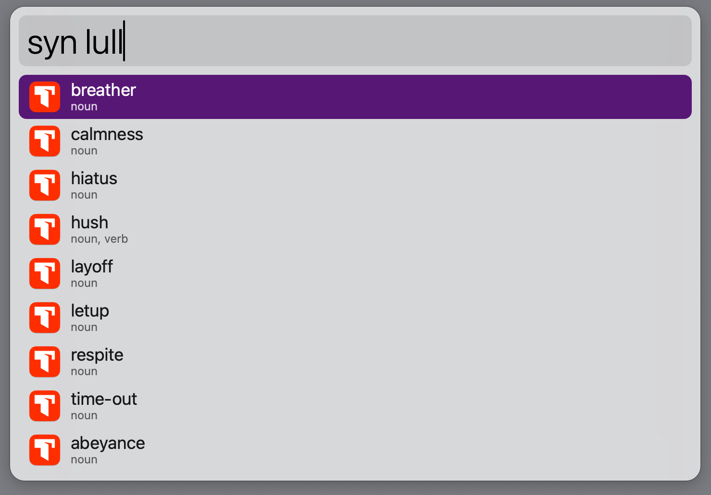
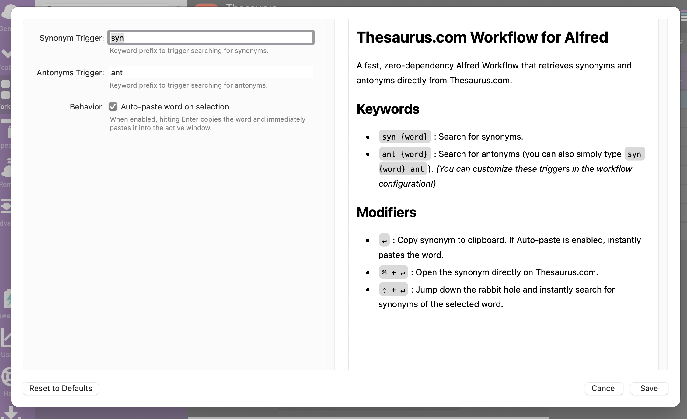
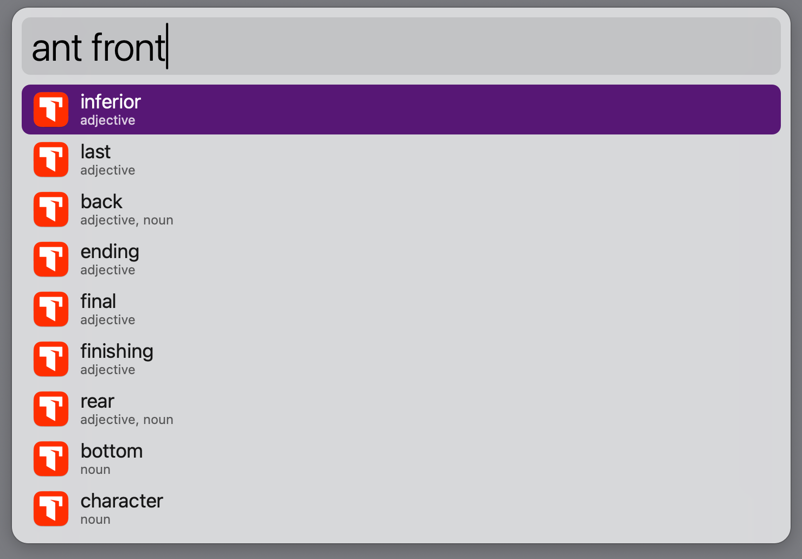
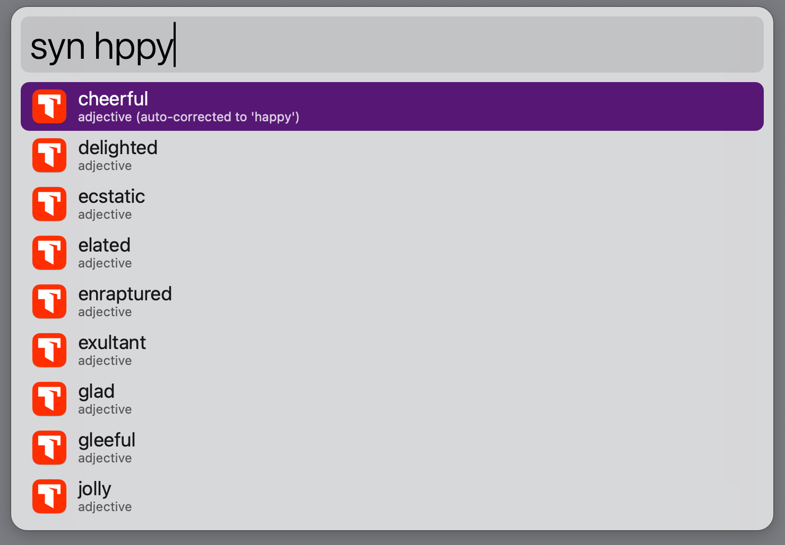

# Alfred Thesaurus.com Workflow

A fast, no-dependency Alfred Workflow that retrieves synonyms and antonyms natively from [Thesaurus.com](https://www.thesaurus.com).

Designed for writers, developers, and academics who want quick vocabulary lookups directly from their local environment. 

---

## Key Features

- **No External Dependencies:** Built with standard Python 3, so it opens without requiring third-party library installations.
- **Auto-Correction:** If you misspell a word, the workflow catches the underlying redirect and auto-corrects your results, noting the change in the subtitle.
- **Part of Speech Filtering:** Narrow your results to show strictly nouns, verbs, or adjectives using a simple shortcut key.
- **Configurable Settings:** Integrates with Alfred's Configuration panel, allowing you to remap keywords visually.

## Installation & Setup

1. Download the latest `Thesaurus.alfredworkflow` package from the [Releases](https://github.com/CitizenEldon/alfred-thesaurus.com/releases) page.
2. Double-click the file to install it directly into Alfred. *(Requires Alfred 5+ and Powerpack).*

> [!NOTE] 
> This workflow acts primarily through macOS standard libraries but requires **Python 3**. Python 3 comes pre-installed on most modern macOS environments, Xcode Command Line Tools, or via Homebrew.

## Configuration

You can customize the workflow's behavior via Alfred's native User Configuration interface:

| Parameter | Default | Description |
| :--- | :--- | :--- |
| **Synonym Trigger** | `syn` | The keyword prefix used to search for synonyms. |
| **Antonyms Trigger** | `ant` | The keyword prefix used to search for antonyms. |
| **Auto-paste** | `Enabled` | When hitting Enter, the workflow directly pastes the selected word into your active window. |

## Usage Guide

Trigger the workflow within Alfred using your configured keywords. 

### Core Commands

- **`syn <word>`** : Search for synonyms of a word.
- **`ant <word>`** : Search for antonyms of a word.

### Part of Speech Filtering

When viewing a large list of synonyms, you can narrow your results down by appending a part-of-speech abbreviation. For example, typing `syn run n` will filter the list to only show **noun** forms of "run".

**Supported Filters:**

- `v` (verb)
- `n` (noun)
- `adj` (adjective)
- `adv` (adverb)
- `prep` (preposition)
- `pron` (pronoun)
- `conj` (conjunction)

### Action Modifiers

Hit these modifier keys when pressing `Enter` on a selected result to trigger context actions:

- `Enter` **(↵)** : Copy word to clipboard (and Auto-Paste if configured).
- `Command + Enter` **(⌘↵)** : Open the word directly on Thesaurus.com in your default browser.
- `Shift + Enter` **(⇧↵)** : Instantly initiate a brand new Alfred search for the synonyms of the highlighted word.

---

## License & Credits

- Crafted by [Eldon Baines](https://github.com/CitizenEldon).
- Distributed under the [MIT License](LICENSE).
- Linguistic data is dynamically parsed from [Thesaurus.com](https://www.thesaurus.com). This is an unofficial plugin and is not directly affiliated with Dictionary.com, LLC.
